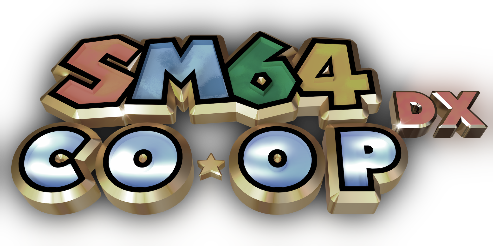

sm64coopdx was an online multiplayer project for the Super Mario 64 PC port that synchronized all entities and every level for multiple players. The project was started by the Coop Deluxe Team, but unfortunately has ceased operations starting July 20, 2026.

See what the future holds [here](https://discord.gg/TJVKHS4).

We're all sorry to see the game go, but we've recently come under fire from several legal entities and have made the difficult decision to close down. We wish you the best in your next phase.

--------------------------------------------------------

Wishlist Nitro Thrash on [Steam](https://store.steampowered.com/app/3290330/Nitro_Thrash/)!

Learn more at [djoslin.info](https://djoslin.info/projects/nitro-thrash/)

Join the [Discord guild](https://discord.gg/HqWTq9X86g) for updates!